# 智链宝 V2.0 — DATA_MODEL.md

> 版本：v1.2
> 状态：开发基线（已确认）  
> 产品版本：智链宝 V2.0  
> 上游规格：PRD v1.3、PERMISSIONS.md v1.3、STATE_MACHINES.md v1.1、TECH v1.0
> 用途：定义 V2 的核心实体、实体边界、主外键关系、历史/版本/快照策略和关键数据库约束。  
> 注意：本文件是“实体关系模型”，不是最终字段字典；字段类型、长度、是否必填、索引细节在 DATA_DICTIONARY.md / Prisma Schema 中继续细化。

> v1.1 技术校正：依据 PRD §22.2，将“组织”与“行政区域 / 地图边界”拆为独立实体，增加 `AdministrativeArea` 与 `OrganizationAreaMapping`；企业正式归属改为引用 `responsible_area_id`。此调整不改变已确认产品规则，只避免后续地图和组织权限耦合。
> v1.2 角色校正：`RoleAssignment.role_code` 增加独立 `MINISTER`；部长复用既有人员、账号与角色授权历史，不新增部长账号或档案实体，也不复用团长批次任命记录。


---

# 1. 总体建模原则

## 1.1 一人一档、一人一账号

平台内部人员统一使用：

```text
Person
  ↓ 0..1
Account
```

- `Person` 是不可变业务主体；
- `Account` 是登录载体；
- 人员姓名、手机号、任职、角色不能混成一张“用户表”；
- 同一人员延任、调岗、兼任、成为团长、成为部长、成为管理员，都不能重新创建人员；
- 历史往届可有 `Person` 档案但没有 `Account`；
- 外部人才不是内部 `Person`，使用独立 `Talent`；
- 企业不是平台用户，不创建 `Account`。

---

## 1.2 内部 ID 与业务编号分离

每个正式实体使用不可变内部 ID。

第一阶段建议：

```text
id = UUID
```

例如：

```text
Demand.id = "c1f4..."
```

页面不展示 UUID。

需要人看的业务对象另有：

```text
business_no
```

例如：

```text
XQ-2026-000128  正式需求
XS-2026-000086  需求线索
BX-2026-000035  报销
QZ-2026-000021  办事求助
```

原则：

> 内部 ID 永不因名称、手机号、组织、批次变化而改变。

---

## 1.3 不建立“万能业务表”

禁止重新使用 V1 风格的通用流程表承载所有业务。

错误：

```text
BusinessRecord
type
status
data_json
```

然后需求、报销、人才、行程全部塞 JSON。

V2 必须按正式业务建立独立实体：

```text
Demand
Reimbursement
TalentTownshipRound
Trip
HelpRequest
...
```

原因：

- 状态机不同；
- 权限不同；
- 统计口径不同；
- 审计不同；
- 数据完整性要求不同。

---

## 1.4 核心关系使用真实外键

对于核心业务关系，不使用：

```text
entity_type + entity_id
```

代替真实外键。

例如需求必须真正关联：

```text
Demand.enterprise_id → Enterprise.id
Demand.responsible_township_id → Organization.id
```

而不是：

```text
relation_type = "enterprise"
relation_id = "..."
```

只有这些横切系统适合通用对象引用：

- Attachment；
- AuditLog；
- OutboxEvent；
- Todo / Message 跳转目标；
- Import / Migration 映射。

---

## 1.5 不做全局“软删除”

正式业务不统一使用一个模糊的：

```text
deleted_at
```

来表达所有终止状态。

按业务语义明确保存：

```text
DISABLED
CANCELED
WITHDRAWN
MERGED
CLOSED
```

临时文件、临时任务等技术数据才允许普通清理 / 删除策略。

---

## 1.6 历史关系必须保存生效区间

以下关系不能直接覆盖：

- 人员任职；
- 角色授权；
- 部门负责镇区；
- 团员批次；
- 团长任命；
- 部长角色授权；
- 高权限授权；
- 需求主责；
- 协同人员；
- 往届协助；
- 人才当前对接联系人；
- 办事求助主办人。

统一使用：

```text
effective_at
expired_at
```

或业务等价字段。

历史关系永远保留。

---

## 1.7 正式业务保存必要快照

当“当前源数据变化”会导致历史展示漂移时，保存业务发生当时快照。

必须包含的典型快照：

- 正式需求选择的企业联系人；
- 正式需求来源原文；
- AI 推荐时的推荐依据；
- 人才原推荐人；
- 人才当前联系人任期；
- 报销关联行程；
- 导入前原记录；
- 正式数据纠错前版本。

原则：

> 外键用于追踪“现在是谁”，快照用于还原“当时是什么”。

---

# 2. 顶层领域

V2 数据模型分为以下领域：

```text
A. 人员 / 账号 / 组织 / 权限
B. 团员 / 批次
C. 企业
D. 需求闭环
E. 人才
F. 政策
G. 来离宝 / 行程 / 走访
H. 报销
I. 办事求助
J. 公告 / 消息 / 待办
K. 文件 / AI / OCR / 搜索
L. 导入 / 导出 / 报表
M. 审计 / 系统 / 迁移 / 备份
N. 第二阶段领导与督办（第一阶段预留）
```

---

# 3. 总体关系图

```mermaid
flowchart TB
  Person --> Account
  Person --> Appointment
  Appointment --> Organization
  Person --> RoleAssignment
  Person --> SpecialPermissionGrant

  Person --> BatchMembership
  BatchMembership --> Batch
  Person --> GroupLeaderAssignment
  GroupLeaderAssignment --> Batch

  Organization --> DepartmentTownshipRelation

  Enterprise --> EnterpriseContact
  Enterprise --> Demand
  Enterprise --> EnterpriseVisit

  DemandLead --> Demand
  EnterpriseVisit --> DemandLead
  Demand --> DemandOwnerHistory
  Demand --> DemandCollaborator
  Demand --> DemandAlumniHelper
  Demand --> DemandProgress
  Demand --> DemandOutcomeRound
  Demand --> DemandRecommendationRun

  Talent --> TalentContactPersonHistory
  Talent --> TalentTownshipRound
  TalentTownshipRound --> TalentTownshipProgress

  Policy --> PolicyContentVersion
  Policy --> PolicyReplacementRelation

  Person --> PresenceReport
  Person --> TripParticipant
  Trip --> TripParticipant
  Trip --> TripNode
  TripNode --> EnterpriseVisit

  Person --> Reimbursement
  Reimbursement --> ReimbursementExpenseItem
  Reimbursement --> ReimbursementSubsidyItem

  Person --> HelpRequest
  HelpRequest --> HelpAssignmentHistory
  HelpRequest --> HelpProgress

  Announcement --> AnnouncementVersion
  AnnouncementVersion --> AnnouncementRecipientState

  Person --> Message
  Person --> Todo

  Attachment --> AttachmentAccessLog
```



---

# 4. 人员、账号、组织与权限

## 4.1 Person

**含义：内部真实人员的永久主档。**

关键关系：

```text
Person 1 — 0..1 Account
Person 1 — N Appointment
Person 1 — N RoleAssignment
Person 1 — N SpecialPermissionGrant
Person 1 — N BatchMembership
```

Person 不因为以下变化而新建：

- 手机号改变；
- 任职改变；
- 批次改变；
- 角色改变；
- 从在任变往届；
- 延任；
- 成为团长；
- 成为部长；
- 成为管理员。

历史业务署名全部关联 `person_id`。

---

## 4.2 Account

**含义：Person 的登录载体。**

约束：

- 一个 Person 最多一个当前平台账号；
- 一个手机号同一时间最多对应一个有效账号；
- 账号状态独立于人员状态；
- 密码只存哈希；
- 手机号变化不改变 `person_id`。

关系：

```text
Account 1 — N Session
Account 1 — 1 PermissionVersion
```

建议额外维护：

```text
AccountPhoneHistory
```

用于永久记录手机号变更前后值、原因、操作人和时间。

---

## 4.3 Session

**含义：一台有效设备的一次持久登录。**

关键约束：

- 同账号最多 2 条有效 Session；
- 第 3 台设备登录时失效最老有效 Session；
- Session 保存创建时 `permission_version`；
- 密码修改、重置、停用等按规则使 Session 失效。

---

## 4.4 Organization

统一承载内部“人属于哪个单位 / 组织”的目录。

组织类型至少：

```text
TOWNSHIP_ORG      镇区 / 园区工作组织
DEPARTMENT        部门
DISPATCH_UNIT     派出单位
POST_UNIT         挂职单位
OTHER_INTERNAL    其他内部组织
```

`Organization` 解决“人员任职在哪里”，不直接承载地图行政边界。

---

## 4.5 AdministrativeArea

**含义：县、镇区、园区等业务行政区域与地图边界主体。**

区域类型至少：

```text
COUNTY
TOWNSHIP
PARK
HIGH_TECH_ZONE
DEVELOPMENT_ZONE
OTHER_AREA
```

关键关系：

```text
AdministrativeArea 1 — N Enterprise
AdministrativeArea 1 — N MapBoundaryVersion
Organization N — M AdministrativeArea（通过 OrganizationAreaMapping）
Department Organization N — M AdministrativeArea（通过 DepartmentTownshipRelation）
```

这样明确分开：

```text
Organization
= 谁在哪个组织任职

AdministrativeArea
= 企业归属哪个业务区域、地图画哪块边界
```

例如“高新区”可以同时存在：

- 一个负责日常工作的组织；
- 一个业务行政区域 / 地图边界。

二者通过映射关联，但不混为同一张表。

企业的正式归属使用 `responsible_area_id`，不通过经纬度推断。

---

## 4.6 OrganizationAreaMapping

用于把镇区 / 园区工作组织映射到其负责的业务区域。

允许未来一个组织对应多个区域，或因行政调整保留历史映射。

必须保存：

```text
organization_id
area_id
effective_at
expired_at
```

---

## 4.7 Appointment

**Person 与 Organization 的任职关系。**

一个 Person 可以同时有多条有效任职：

```text
Person N — M Organization
```

通过 Appointment 实现。

必须保存：

- 人员；
- 组织；
- 岗位；
- 生效时间；
- 失效时间；
- 是否主要任职等必要属性。

调岗：

> 结束旧 Appointment，新建新 Appointment，不覆盖旧记录。

---

## 4.8 DepartmentTownshipRelation

**部门负责镇区关系。**

```text
Department Organization N — M AdministrativeArea
```

必须是独立时效关系：

```text
department_organization_id
area_id
effective_at
expired_at
```

名称继续保留 `DepartmentTownshipRelation`，但底层目标使用 `AdministrativeArea`，从而兼容镇、园区、高新区等不同区域类型。

部门工作人员的数据范围由：

```text
当前有效部门任职
+
当前有效 DepartmentTownshipRelation(area_id)
```

动态计算。

---

## 4.9 RoleAssignment

保存基础 / 高层角色授权历史。

例如：

```text
MEMBER_CURRENT
MEMBER_ALUMNI_PLATFORM
TOWNSHIP_STAFF
DEPARTMENT_STAFF
ADMIN
SUPER_ADMIN
GROUP_LEADER
MINISTER
LEADER_STAGE2
```

`GROUP_LEADER` 与 `MINISTER` 是两个独立角色代码，可在权限层共同映射 `TEAM_COORDINATOR_CAPABILITIES`，不得在数据层合并为同一角色。`MINISTER` 的高权限授权必须保存 `effective_at`、`expired_at`、`granted_by_person_id` 和 `reason`；角色撤销保留历史记录。

部长继续使用既有 `Person + Account`。不得新增 `MinisterAccount`、`MinisterProfile` 或其他重复人员实体，也不得通过 `Appointment.title = "部长"` 自动创建角色授权。

但业务中的“需求主责”“办事求助主办人”不是系统角色，不得塞进 RoleAssignment。

---

## 4.10 SpecialPermissionGrant

保存显式敏感授权，例如：

```text
reimbursement.manage
reimbursement.apply
ai.service_manage
```

核心系统级超级管理员能力可直接由 `SUPER_ADMIN` 映射，不必为每个超级管理员重复创建大量权限记录。

---

## 4.11 PermissionVersion

每个 Account 维护当前权限版本。

以下变化触发递增：

- 任职；
- 角色；
- 部门负责镇区；
- 批次；
- 团长；
- 部长；
- 特殊授权；
- 手机号等需要重新登录的安全变化。

用于 Session 权限缓存快速失效。

---

# 5. 团员与批次

## 5.1 Batch

科技镇长团活动批次。

一个时间点存在：

```text
current_active_batch
```

但历史 Batch 永久保留。

---

## 5.2 BatchMembership

**一个人员在一个批次的团员身份。**

关系：

```text
Person 1 — N BatchMembership
Batch 1 — N BatchMembership
```

唯一约束：

```text
UNIQUE(person_id, batch_id)
```

一个人最多参与 3 个批次属于业务规则校验，不通过重复 Person 实现。

地图 / 当前批次人数：

> 按 `person_id` 去重。

---

## 5.3 GroupLeaderAssignment

团长必须绑定：

```text
person_id
batch_id
effective_at
expired_at
```

并验证该人员存在同批次有效 `BatchMembership`。

团长使用本人 Account，不创建团长账号。

`GroupLeaderAssignment` 只表达团长与当前批次的任命关系，不承载部长身份。部长通过 `RoleAssignment(role_code = MINISTER)` 显式授权；本版本不假设部长必须是当前批次在任团员。

---

## 5.4 MemberCapabilityProfile

团员本人允许维护的能力画像从行政档案中分离。

建议独立实体：

```text
MemberCapabilityProfile
```

用于：

- 专业方向；
- 熟悉行业；
- 可协调资源；
- 意向需求类型；
- AI需求推荐。

管理员任职字段不应被团员本人能力编辑覆盖。

---

# 6. 企业领域

## 6.1 Enterprise

正式企业主档。

关键关系：

```text
Enterprise N — 1 responsible_area
Enterprise 1 — N EnterpriseContact
Enterprise 1 — N Demand
Enterprise 1 — N EnterpriseVisit
```

业务归属与地图坐标分别保存。

```text
responsible_area_id
≠
latitude / longitude
```

修改坐标不得改变镇区。

---

## 6.2 EnterpriseContact

企业联系人独立于 Enterprise 主表。

关系：

```text
Enterprise 1 — N EnterpriseContact
```

规则：

- 不物理删除；
- ACTIVE / INACTIVE；
- 同企业同一时间只能一个有效主要联系人；
- 停用主要联系人前必须先指定新的主要联系人。

正式需求另存联系人快照。

---

## 6.3 EnterpriseChangeRequest

统一承载：

```text
CREATE        企业新增申请
CORRECTION    企业纠错申请
```

关联：

- 提交人；
- 拟关联镇区；
- 目标正式企业（纠错时）；
- 审核人；
- 审核结果；
- 通过后正式企业。

管理员直接正式维护可以不创建普通申请，但必须进入正式版本 / 审计。

---

## 6.4 EnterpriseVersion

正式企业核心字段修改后保存版本。

用于：

- 修改前后比对；
- 纠错；
- 审计；
- 合并恢复辅助。

不要把版本 JSON 当正式当前数据源：

```text
Enterprise = 当前正式数据
EnterpriseVersion = 历史版本
```

---

## 6.5 EntityMerge / EnterpriseMerge

企业、人才、正式需求都有合并需求。

建议建立统一高风险合并主记录：

```text
EntityMerge
```

保存：

- entity_type；
- source_id；
- target_id；
- 操作人；
- 原因；
- 影响预览快照；
- 操作时间；
- 恢复状态。

但每种业务的实际关联迁移逻辑仍放在各自 Service。

被合并实体保留：

```text
merged_into_id
```

或等价只读指向。

---

# 7. 需求闭环

## 7.1 DemandLead

需求线索是独立正式实体，不是 Demand 的“草稿状态”。

来源包括：

```text
ENTERPRISE_PUBLIC
MEMBER_VISIT
OTHER_LEAD_SOURCE
```

以及未关联正式企业的场景。

必须永久保存原始：

- 来源文字；
- 原始附件；
- 来源人员 / 渠道；
- 来源时间；
- 原始企业信息；
- 走访信息；
- 公开页上下文。

DemandLead 可：

```text
0..1 → Demand
```

正式 Demand 可有：

```text
0..N DemandLead
```

因为多个重复线索可能最终作为来源关联到同一正式需求。

---

## 7.2 DemandProvenance

建议正式建立统一需求来源实体：

```text
DemandProvenance
```

用于表示正式需求所有来源：

```text
TOWNSHIP_DIRECT
ADMIN_DIRECT
DEMAND_LEAD
V1_MIGRATION
MERGED_SOURCE
```

关系：

```text
Demand 1 — N DemandProvenance
```

这样：

- 镇区正式录入可以没有 DemandLead；
- 管理员代录可以没有 DemandLead；
- 多条合并线索可全部永久挂到同一 Demand；
- V1迁移来源可以完整标识。

---

## 7.3 Demand

正式需求主记录。

核心关系：

```text
Demand N — 1 Enterprise
Demand N — 1 responsible_area
Demand N — 0..1 Batch（发布/归属批次）
Demand 1 — N Provenance
Demand 1 — N Progress
Demand 1 — N ParticipantHistory
Demand 1 — N OutcomeRound
```

需要保存：

- 当前主状态；
- 业务编号；
- 类型；
- 紧急程度；
- 首次发布时间；
- 当前责任模型；
- 选定企业联系人外键；
- 联系人快照。

---

## 7.4 DemandContactSnapshot

不只依赖当前 `EnterpriseContact`。

正式需求在关键形成时保存：

```text
DemandContactSnapshot
```

包括当时：

- 联系人姓名；
- 职务；
- 电话；
- 企业名称等必要历史字段。

EnterpriseContact 后续变化不得改变历史需求展示。

---

## 7.5 DemandOwnerHistory

在任正式主责单独保存历史。

关系：

```text
Demand 1 — N DemandOwnerHistory
```

同一时间最多：

```text
1 active owner
```

负责人转交：

- 关闭旧 owner 生效区间；
- 创建新 owner；
- 保留原因；
- 超级管理员操作。

往届协助绝不能写进本表作为 owner。

---

## 7.6 DemandCollaborator

协同关系独立保存：

```text
ACTIVE
LEFT
REMOVED
```

保留：

- 申请 / 邀请来源；
- 生效；
- 退出；
- 移除；
- 原因。

历史进展不随关系结束删除。

---

## 7.7 DemandAlumniHelper

往届协助独立于主责和协同。

关联：

```text
Demand
Person（平台内往届）
或历史往届档案
```

历史往届没有 Account 时，允许关联 Person 档案并由镇区 / 管理员代录结果。

---

## 7.8 DemandTownshipHandler

往届协助路径下需要明确镇区经办人。

使用独立时效关系：

```text
DemandTownshipHandler
```

避免把“镇区经办人”误写成正式主责。

---

## 7.9 DemandProgress

每一次进展是一条不可覆盖记录。

关系：

```text
Demand 1 — N DemandProgress
```

保存：

- 当前进展；
- 下一步；
- 提交人；
- 时间；
- 附件；
- 是否来自主责 / 协同 / 往届 / 镇区代录。

“最新进展”通过查询产生，不覆盖历史。

`DemandProgress` 是 append-only 正式事实：不提供编辑、覆盖或删除旧进展的业务动作。历史往届线下代录同时保存真实 `createdByPersonId`、`representedPersonId` 与 `sourceType`，不得冒充往届本人在线提交。

进展附件通过 `AttachmentLink(entityType=DEMAND_PROGRESS)` 关联私有附件；正式关联前要求 `UPLOADED + PASSED + objectKey`，每次下载重新按父 Demand 可见性鉴权。

### 7.9.1 当前责任模式

进展、办结、退出和转交统一通过 transaction-aware responsibility resolver 识别：

```text
CURRENT_OWNER
  currentOwnerPersonId = 唯一 active DemandOwnerHistory.personId

ALUMNI_TOWNSHIP
  currentOwnerPersonId = null
  唯一 active DemandTownshipHandler
  至少一个 active DemandAlumniHelper
```

两种结构同时存在、Owner 指针与历史不一致、缺少 handler/helper 或出现多个 active handler 时，关键 mutation fail-safe 拒绝，不静默猜测责任人。

### 7.9.2 DemandProgressReminder

```text
Demand 1 — N DemandProgressReminder
```

`DemandProgressReminder` 是团队协调提醒的持久化限频证据，保存 reminder type、发送人、唯一责任接收人、责任模式与发送时间，记录 append-only。它不是从 Message/Todo 反推的临时状态。

### 7.9.3 DemandCloseRequest / DemandCloseReview

```text
Demand 1 — N DemandCloseRequest
DemandCloseRequest 1 — 0..1 DemandCloseReview
```

每次办结提交创建新的 immutable `DemandCloseRequest`；退回后的重新提交使用递增 `submissionNo`，旧正文、责任快照与附件永久保留。`activeKey` 只标识当前待审核申请。

每个 CloseRequest 至多一个 immutable `DemandCloseReview`，保存 ADMIN / SUPER 的 decision、镇区核验结果、退回原因和审核时间。审核不会覆盖 CloseRequest 正文。

CloseRequest 附件使用 `AttachmentLink(entityType=DEMAND_CLOSE_REQUEST)`，历史申请的证据仍按父 Demand 可见性访问。

### 7.9.4 DemandOwnerExitRequest

```text
Demand 1 — N DemandOwnerExitRequest
```

退出申请保存 owner 与 OwnerHistory 快照、申请原因、审核状态/人员/意见和时间；同 Demand 最多一个 active PENDING，APPROVED/REJECTED 历史永久保留。审核期间正式 owner 与 active OwnerHistory 不变。

### 7.9.5 Demand completion / cancellation facts

Demand 保存受控当前事实：

```text
completedAt
completionBatchId
canceledAt
canceledReason
```

`completedAt` 是办结审核批准时间；`completionBatchId` 是批准时校验仍为 ACTIVE 的 `currentFollowBatchId`。M1-006 不创建 Outcome，M1-007 只从 COMPLETED Demand 与最终批准的 CloseRequest/Review 接续。

---

## 7.10 DemandRecommendationRun

每次 AI 推荐建立一次 Run。

```text
Demand 1 — N DemandRecommendationRun
```

每次 Run：

```text
DemandRecommendationRun
  1 — N DemandRecommendationItem
```

Item 保存：

- 推荐 Person；
- 推荐对象类型（在任 / 往届）；
- 推荐时依据快照；
- 短推荐理由；
- 规则版本；
- Prompt版本；
- 模型 / 能力配置；
- 用户反馈（暂不参与 / 愿意协助等）。

人员资料以后修改，不改变旧推荐依据。

Run 使用 `CURRENT | ALUMNI` 阶段与
`PENDING | RUNNING | SUCCEEDED | FALLBACK_SUCCEEDED | FAILED` 状态。只有成功或规则降级成功时
才在事务内把旧 Run 的 `currentKey` 置空，再把新 Run 设为 `1`。

往届正式协助使用独立关系：

```text
Demand 1 — N DemandAlumniHelper
Demand 1 — N DemandTownshipHandler（同时最多 1 个 current）
```

`DemandAlumniHelper` 不是 Owner 或 Collaborator；`DemandTownshipHandler` 是往届路径的当前镇区责任人。

---

## 7.11 DemandStateHistory / DemandReview

状态历史使用统一 `StateTransitionHistory`。

但需求审核属于关键业务，可额外建立：

```text
DemandReview
```

保存：

- 审核人；
- 决策；
- 退回原因类型；
- 退回文本；
- 时间。

这样后台可直接查询审核业务，不必只依赖通用审计日志。

---

## 7.12 DemandFormalVersion

正式发布后纠错使用：

```text
DemandFormalVersion
```

当前 Demand 保存当前值。

每次管理员正式纠错：

- 保存旧版本；
- 保存新版本；
- 原因；
- 操作人；
- 通知相关人。

---

## 7.13 DemandOutcomePlan

需求办结审核通过后保存成效跟踪策略：

```text
NONE
TRACKING
```

若跟踪：

- 首次计划日期；
- 当前下次跟踪日期；
- 是否已结束。

---

## 7.14 DemandOutcomeRound

一次需求可以多轮成效跟踪：

```text
Demand 1 — N DemandOutcomeRound
```

每轮保存：

- 跟踪时间；
- 定量字段；
- 定性说明；
- 下次跟踪日期；
- 是否结束；
- 审核状态；
- 填报镇区 / 人员；
- 管理员审核。

只有审核通过轮次进入正式统计。

数值字段后续 DATA_DICTIONARY 必须标明：

```text
本轮新增
当前累计
时点值
```

不得混用。

---

# 8. 人才领域

## 8.1 Talent

外部人才主档。

Talent：

- 不对应 Person；
- 不创建 Account；
- 不保存结构化人才本人电话 / 邮箱字段。

核心关系：

```text
Talent 1 — 1 immutable original_recommender
Talent 1 — N contact_person_history
Talent 1 — N township_round
```

---

## 8.2 TalentOriginalRecommenderSnapshot

Talent 必须保存：

```text
original_recommender_person_id
+
original_recommender_snapshot
```

原推荐人形成正式数据后不可静默替换。

外部渠道来源也必须指定一名内部推荐责任人。

---

## 8.3 TalentContactPersonHistory

当前对接联系人是可变化关系。

```text
Talent 1 — N TalentContactPersonHistory
```

同一时间最多一个当前联系人。

变化时：

- 结束旧关系；
- 新建新关系；
- 原因；
- 操作人；
- 历史责任不漂移。

---

## 8.4 TalentChangeRequest

统一承载：

```text
CREATE
CORRECTION
```

团员、镇区、部门可提交。

管理员审核入库。

管理员直接维护仍保留正式版本和审计。

---

## 8.5 TalentVersion

人才正式信息修改保留版本。

当前值仍以 Talent 为准。

---

## 8.6 TalentTownshipRound

人才与镇区通过“对接轮次”形成多对多：

```text
Talent N — M Township
```

关系实体：

```text
TalentTownshipRound
```

同一：

```text
talent_id + township_id
```

同时最多一条 `IN_PROGRESS`。

终态：

```text
COMPLETED
WITHDRAWN
```

不得重新打开，后续事项新建下一轮。

---

## 8.7 TalentTownshipProgress

一个对接轮次可以有多条不可覆盖进展：

```text
TalentTownshipRound 1 — N TalentTownshipProgress
```

---

# 9. 政策领域

## 9.1 Policy

政策主实体保存：

- 发布状态；
- 效力状态；
- 当前内容版本；
- 基础来源信息。

---

## 9.2 PolicyContentVersion

每次标题、正文、主文件、补充附件发生实质修改：

```text
Policy 1 — N PolicyContentVersion
```

正式展示指向当前版本。

---

## 9.3 PolicyReplacementRelation

政策替代关系必须是独立实体：

```text
new_policy_id
old_policy_id
confirmed_by
confirmed_at
reason
```

不得仅保存：

```text
old_policy.status = REPLACED
```

否则无法解释“被谁替代”。

新政策撤回：

> 不自动删除 relation，也不自动恢复旧政策 CURRENT。

管理员根据正式依据调整关系。

---

## 9.4 PolicyTag / PolicyTagRelation

```text
Policy N — M PolicyTag
```

用于结构化筛选和 AI 检索。

---

## 9.5 PolicyAIInterpretation

AI解读与原文分离。

保存：

- 结构化解读；
- 模型 / Prompt版本；
- 生成人；
- 人工确认状态。

解读条目需要能关联：

```text
原文件
页码 / 段落
```

以支持“查看原文依据”。

---

# 10. 来离宝、行程与企业走访

## 10.1 PresenceReport

每次来宝一张完整报备。

```text
Person 1 — N PresenceReport
```

不拆成 arrival / departure 两张记录。

包含：

```text
arrival_at
expected_departure_at
cancelled_at
```

当前状态通过时间派生。

数据库 / Service 必须防止同 Person 有重叠有效区间。

---

## 10.2 Trip

一次工作行程主记录。

```text
Trip 1 — N TripParticipant
Trip 1 — N TripNode
```

Trip 公共信息只保存一次。

共享行程不能按参与人数复制多条。

---

## 10.3 TripParticipant

```text
Trip N — M Person
```

参与人关系。

必要时保存：

- 是否创建人；
- 加入时间；
- 退出状态；
- 历史。

---

## 10.4 TripNode

一条 Trip 包含一个或多个节点：

```text
Trip 1 — N TripNode
```

节点可：

```text
0..1 → Enterprise
```

也可以是普通活动地点。

节点顺序必须稳定，例如：

```text
sequence_no
```

---

## 10.5 TripResult

总体共享结果只保存一次：

```text
Trip 1 — 0..1 TripResult
```

任一参与人完成后，Trip 完成。

---

## 10.6 TripNodeResult

允许对每个企业 / 节点补充结果：

```text
TripNode 1 — 0..1/N TripNodeResult
```

建议“当前正式节点结果 + 补充历史”分开，不允许参与人相互覆盖。

---

## 10.7 EnterpriseVisit

完成的企业节点形成正式企业走访。

```text
TripNode 0..1 — 1 EnterpriseVisit
```

唯一约束至少保证：

```text
trip_id + enterprise_id
```

不会因行程后续编辑反复生成。

EnterpriseVisit 可生成：

```text
1 — N DemandLead
```

---

## 10.8 VisitSupplement

参与人可以追加补充：

```text
EnterpriseVisit 1 — N VisitSupplement
```

各条补充独立保存，不覆盖别人内容。

---

# 11. 报销领域

## 11.1 Reimbursement

报销主单：

```text
TRAVEL      差旅报销
ACTIVITY    活动报销
```

关系：

```text
Person 1 — N Reimbursement
Reimbursement 1 — N ExpenseItem
Reimbursement 1 — N StateHistory
```

可选关联工作行程。

---

## 11.2 ReimbursementTripSnapshot

如报销关联行程：

```text
trip_id
+
trip_snapshot
```

同时保存。

后续行程纠错不能改变已提交报销历史展示。

---

## 11.3 ReimbursementExpenseItem

统一保存“实际发生费用明细”。

### 差旅

允许实际费用：

```text
TRANSPORT_ACTUAL      交通费（飞机票、高铁票等）
ACCOMMODATION_ACTUAL  住宿费
```

差旅中：

- 出租车 / 网约车不自动纳入交通费；
- 餐饮实际发票不进入差旅餐补。

### 活动

活动报销允许灵活费用类别：

```text
常用类别
+
OTHER + expense_name
```

不能只写死“餐饮”。

---

## 11.4 ReimbursementSubsidyItem

交通补助 / 伙食补助和发票实际费用分开建模：

```text
TRANSPORT_SUBSIDY
MEAL_SUBSIDY
```

第一阶段：

- 交通补助基准 80 元/天；
- 伙食补助基准 100 元/天；
- 主要人工填写。

**补助天数精确计算规则当前 PRD 未定义。**

因此数据模型必须支持：

- 人工录入天数；
- 人工录入金额；
- 后续 rule_version；
- 计算依据。

不得现在硬编码“自然日差值+1”等猜测公式。

---

## 11.5 ReimbursementInvoice / OCRResult

票据和费用明细分离。

建议：

```text
ReimbursementInvoice
```

关联：

- 原文件 Attachment；
- OCR任务；
- OCR结构化结果；
- 用户最终确认字段；
- 可选 ExpenseItem。

OCR结果不是正式费用真源。

---

## 11.6 ReimbursementMaterialFlow

纸质材料流转保存独立历史：

```text
ReimbursementMaterialFlow
```

例如：

- 已核对；
- 收到纸质材料；
- 已提交财务；
- 状态纠正。

这样即使主状态保留当前值，线下流转历史仍完整。

---

# 12. 办事求助

## 12.1 HelpRequest

主单。

类型：

```text
住宿
交通
餐饮
工作
生活
其他
```

关系：

```text
Person 1 — N HelpRequest
HelpRequest 1 — N HelpAssignmentHistory
HelpRequest 1 — N HelpProgress
```

---

## 12.2 HelpAssignmentHistory

不要只在 HelpRequest 上覆盖：

```text
owner_id
```

而应保存每次：

- 管理员直接分派；
- 转交单位；
- 单位人员接手；
- 管理员重新分派。

同一时间只有一个有效当前主办人。

---

## 12.3 HelpTransferredOrganization

转交单位关系可以作为 HelpAssignmentHistory 的一种 assignment target，或独立结构。

需要保证：

> 当前被转交单位的有效工作人员可以看到待接手池。

---

## 12.4 HelpProgress

主办人更新过程使用追加式记录：

```text
HelpRequest 1 — N HelpProgress
```

不反复覆盖一个“大文本”。

---

# 13. 公告、消息与待办

## 13.1 Announcement

公告主记录保存：

- 当前发布状态；
- 当前内容版本；
- 置顶；
- 发布人。

---

## 13.2 AnnouncementVersion

标题 / 正文 / 附件发生实质变化：

```text
Announcement 1 — N AnnouncementVersion
```

旧确认历史绑定旧版本。

---

## 13.3 AnnouncementAudienceRule

保存“目标范围规则”，例如：

- 全体；
- 某角色；
- 某组织；
- 指定人员。

范围变更不覆盖旧操作历史。

---

## 13.4 AnnouncementRecipientState

对实际用户建立版本级状态：

```text
AnnouncementVersion
+
Person
```

保存：

```text
UNREAD
READ
CONFIRMED
```

“需确认”公告新内容版本产生后重新创建确认要求。

---

## 13.5 BusinessEvent / OutboxEvent

所有关键业务写操作在同一事务中写入：

```text
OutboxEvent
```

例如：

```text
DEMAND_RETURNED
DEMAND_CLAIMED
TRIP_COMPLETED
REIMBURSEMENT_RETURNED
ANNOUNCEMENT_PUBLISHED
```

Worker 后续消费，生成：

- Message；
- Todo；
- 索引更新；
- AI/OCR后台任务；
- 统计刷新等。

---

## 13.6 Message

用户个人事件通知。

```text
Person 1 — N Message
```

只保存最终接收人，不在读取时实时重算历史接收对象。

---

## 13.7 Todo

用户当前可立即执行的动作。

```text
Person 1 — N Todo
```

建议唯一有效键：

```text
assignee_person_id
business_type
business_id
todo_type
OPEN
```

业务状态变化：

- 完成；
- 或自动失效。

历史 Todo 不删除。

---

# 14. 文件与附件

## 14.1 Attachment

统一文件元数据实体。

实际二进制：

> 腾讯云 COS 私有对象存储。

Attachment 只保存：

- 文件标识；
- COS object key；
- 原文件名；
- 类型；
- 大小；
- SHA-256；
- 上传人；
- 安全扫描状态；
- 权限级别；
- 临时 / 正式状态。

---

## 14.2 AttachmentLink

一个 Attachment 可能需要关联业务版本或记录。

建议使用：

```text
AttachmentLink
```

允许统一关联：

- Demand；
- DemandProgress；
- Talent；
- TalentTownshipProgress；
- PolicyVersion；
- TripResult；
- ReimbursementInvoice；
- HelpRequest；
- AnnouncementVersion 等。

AttachmentLink 属于允许使用通用：

```text
entity_type + entity_id
```

的少数横切实体。

---

## 14.3 AttachmentAccessLog

敏感附件必须保存访问日志：

- 人才原始材料；
- 报销票据；
- 办事求助附件；
- 产品后续定义的敏感文件。

记录：

- 人；
- 文件；
- 预览 / 下载；
- 时间；
- IP；
- 设备 / request_id。

---

# 15. AI、OCR 与语义搜索

## 15.1 AIConversation

荷宝私人对话：

```text
Person 1 — N AIConversation
AIConversation 1 — N AIMessage
```

正文与普通运营日志隔离。

管理员 / 超级管理员均不能通过后台读取他人完整对话正文。

---

## 15.2 AICall

所有 AI 能力统一记录调用元数据：

- capability；
- provider；
- model；
- prompt_version；
- latency；
- status；
- estimated_cost；
- feedback。

正文不直接进入普通 AICall 日志。

---

## 15.3 OCRTask / OCRResult

专业票据 OCR、扫描件解析等任务独立保存。

```text
Attachment
  ↓
OCRTask
  ↓
OCRResult
```

业务正式数据必须经过人确认后写入正式实体。

---

## 15.4 SemanticIndexRecord

VectorDB 只是索引。

MySQL 建议维护：

```text
SemanticIndexRecord
```

用于记录：

- business_type；
- business_id；
- current_version；
- index_status；
- indexed_at；
- last_error。

正式业务数据仍以 MySQL 为唯一真源。

---

# 16. 导入、导出与迁移

## 16.1 ImportTask

一次导入任务主记录。

```text
ImportTask 1 — N ImportRowResult
```

阶段：

- 上传；
- 字段映射；
- 预览；
- 去重；
- 执行预览；
- 快照；
- 导入；
- 结果。

---

## 16.2 ImportRowResult

每行保存：

- 原行号；
- 原始值快照；
- 匹配结果；
- 重复判断；
- 校验错误；
- 最终动作；
- 目标实体 ID。

支持失败报告和可重复执行。

---

## 16.3 ExportTask

复杂导出异步生成。

保存：

- 创建人；
- 导出类型；
- 查询条件快照；
- 数据范围快照；
- 文件；
- 过期时间；
- 下载状态。

下载时再次鉴权。

---

## 16.4 LegacyMigrationMap

V1 → V2 迁移必须保存：

```text
source_system
source_table/type
source_id
target_entity_type
target_id
migrated_at
migration_batch_id
```

唯一约束保证迁移幂等。

无法映射字段进入迁移快照 / 异常记录，不静默丢弃。

---

# 17. 月度台账与统计

## 17.1 MonthlyLedgerArchive

在线统计可以根据当前已纠正结构化数据重新计算。

正式归档建议：

```text
MonthlyLedgerArchive
```

保存：

- 月份；
- 数据范围；
- 生成时间；
- 统计口径版本；
- 文件；
- archive_version。

旧归档版本永久保留。

---

## 17.2 统计真源

第一阶段所有正式统计来自 MySQL 结构化数据。

不从：

- VectorDB；
- AI总结；
- 对话文本；

直接计算正式指标。

---

# 18. 系统、审计、后台任务

## 18.1 StateTransitionHistory

统一状态流转历史。

适用于核心状态变化。

---

## 18.2 AuditLog

不可变审计日志。

记录：

- actor；
- action；
- object；
- before；
- after；
- reason；
- IP；
- device；
- request_id；
- time。

与业务 StateTransitionHistory 区分：

```text
StateTransitionHistory
= 业务状态变化

AuditLog
= 谁做了什么系统/业务操作
```

---

## 18.3 JobTask

MySQL 持久化后台任务。

用于：

- AI；
- OCR；
- 索引；
- 导入；
- 导出；
- 文件扫描；
- 图片压缩；
- 提醒；
- 临时文件清理。

支持：

```text
WAITING
RUNNING
SUCCEEDED
FAILED
CANCELED
```

必须有幂等键。

---

## 18.4 SystemParameter

只存产品明确允许配置的参数。

不能存：

> 任意可改的“需求状态”“角色语义”。

---

## 18.5 WorkCalendar

统一北京时间工作日历、节假日和需要的工作日规则。

---

## 18.6 MapBoundaryVersion

保存：

- 边界版本；
- GeoJSON Attachment / COS key；
- 生效；
- 说明。

边界变化不改变 Enterprise 的业务镇区归属。

---

## 18.7 BackupRecord / RestoreRecord

系统保存备份 / 恢复元数据和操作审计。

实际备份由云基础设施完成。

RestoreRecord 必须能关联：

- DB恢复点；
- COS恢复点 / 文件版本；
- 操作人；
- 原因；
- 一致性检查结果；
- 维护模式时间。

---

# 19. 第二阶段预留实体

第一阶段只建必要底层，不开发完整领导工作台。

## 19.1 LeadershipAssignment

保存：

- 领导 Person；
- 领导类型；
- 数据范围类型；
- 对应组织；
- 生效 / 失效时间。

职位本身不自动产生 `LEADER_STAGE2` 高权限授权。

---

## 19.2 SupervisionTask

第二阶段督办预留：

```text
发起领导
业务对象
责任人 / 责任组织
截止时间
状态
```

业务对象允许通用引用，因为督办可能指向：

- Demand；
- TalentTownshipRound；
- Outcome；
- 其他正式业务。

---

## 19.3 SupervisionReply / Confirmation

保存：

- 责任方回复；
- 回复附件；
- 领导确认；
- 时间线。

第一阶段不需要页面完整实现，但数据库命名应避免未来被迫重构核心 Person / Organization / Permission 模型。

---

# 20. 关键唯一约束

以下必须最终落到数据库约束或事务防并发，不能只靠前端。

## 20.1 人员与账号

```text
Account.person_id 唯一
Account.phone 当前有效唯一
BatchMembership(person_id, batch_id) 唯一
```

---

## 20.2 企业

同企业同一时间：

```text
最多一个 ACTIVE primary contact
```

---

## 20.3 需求

同一需求同一时间：

```text
最多一个 ACTIVE DemandOwner
```

同一人不重复成为同需求活动协同关系。

---

## 20.4 人才

同一：

```text
talent_id + township_id
```

同一时间最多一个：

```text
TalentTownshipRound.IN_PROGRESS
```

同一 Talent 同一时间最多一个 current contact person。

---

## 20.5 行程 / 走访

```text
TripParticipant(trip_id, person_id) 唯一
```

同一完成行程企业走访防重复：

```text
trip_id + enterprise_id
```

或等价稳定唯一键。

---

## 20.6 办事求助

同一 HelpRequest 同一时间：

```text
最多一个 current owner
```

---

## 20.7 待办

同一：

```text
assignee + business + todo_type
```

最多一条有效 `OPEN`。

---

## 20.8 迁移

```text
source_system + source_entity + source_id
```

唯一映射到迁移目标，保证可重复执行。

---

# 21. 时间与时区

数据库时间统一保存明确时区语义。

业务规则统一按：

> 北京时间（Asia/Shanghai）

解释：

- 自然日；
- 自然月；
- 首页“今天”；
- 行程；
- 来离宝；
- 审核时限；
- 月度台账。

推荐：

- 数据库存 UTC 时间戳或带清晰约定的 datetime；
- Service 层统一转换 Asia/Shanghai；
- 禁止各页面自行猜时区。

最终在 DATA_DICTIONARY 明确每个字段。

---

# 22. 金额与数值

所有金额：

> 使用 Decimal，不使用 Float / Double。

例如：

```text
80.00
100.00
```

统计成效数值同样需要在字段字典中标注单位和语义。

---

# 23. 版本和快照策略

## 23.1 当前表 + 历史版本

正式实体采用：

```text
当前主表
+
历史 Version
```

而不是每次读取都从事件日志“重放”得到当前状态。

V2 不采用完整 Event Sourcing。

---

## 23.2 哪些需要业务版本

至少：

- Enterprise；
- Demand 正式内容；
- Talent；
- Policy 内容；
- Announcement 内容。

---

## 23.3 哪些主要用追加记录

至少：

- DemandProgress；
- DemandOutcomeRound；
- TalentTownshipProgress；
- VisitSupplement；
- HelpProgress；
- StateTransitionHistory；
- AuditLog；
- AssignmentHistory。

---

# 24. 不应建模成字段的内容

以下不要错误写成主表 Boolean / String：

### “当前在宝”

不是：

```text
Person.is_in_baoying
```

而是由 PresenceReport 时间计算。

### “久未更新”

不是：

```text
Demand.status = STALE
```

而是 Demand.IN_PROGRESS 的派生关注条件。

### “是否团长”

不能只在 Person：

```text
is_group_leader=true
```

必须由当前 Batch 的 GroupLeaderAssignment 得出。

### “部门负责哪些镇”

不能在 Department：

```text
township_ids = JSON
```

必须 DepartmentTownshipRelation。

### “当前需求负责人”

可以在 Demand 保存冗余 current_owner_id 作为查询优化，但正式历史真源必须是 DemandOwnerHistory，并保持事务一致。

### “人才当前联系人”

可以在 Talent 冗余 current_contact_person_id，但历史真源必须是 TalentContactPersonHistory。

---

# 25. 可以接受的受控冗余

为列表性能，可在主实体保存少量“当前指针”：

```text
Demand.current_owner_person_id
Talent.current_contact_person_id
Announcement.current_version_id
Policy.current_version_id
Enterprise.primary_contact_id
```

条件：

1. 有真实关系 / 历史表作为真源；
2. 所有写入在同一事务更新；
3. 自动测试保证一致；
4. 禁止页面直接修改指针绕过 Service。

---

# 26. Prisma 模块建议

后续 Prisma Schema 可以按领域组织注释，但第一阶段仍建议一个 schema 文件或 Prisma 支持的多文件 Schema（若当前版本稳定支持后再启用）。

逻辑模块：

```text
identity
organization
member
enterprise
demand
talent
policy
presence
trip
reimbursement
help
announcement
notification
attachment
ai
jobs
reporting
system
audit
migration
```

业务 Service 也按相同领域拆分。

---

# 27. M0–M3 建模落地顺序

## M0 基础底座

先建：

```text
Person
Account
Session
Organization
AdministrativeArea
OrganizationAreaMapping
Appointment
DepartmentTownshipRelation
RoleAssignment
SpecialPermissionGrant
Batch
BatchMembership
GroupLeaderAssignment
Attachment
AuditLog
StateTransitionHistory
OutboxEvent
JobTask
```

验证：

> 一人多角色 + 多任职 + 数据范围 + 权限即时失效。

---

## M1 核心需求闭环

再建：

```text
Enterprise
EnterpriseContact
EnterpriseChangeRequest
DemandLead
DemandProvenance
Demand
DemandOwnerHistory
DemandCollaborator
DemandAlumniHelper
DemandTownshipHandler
DemandProgress
DemandRecommendationRun/Item
DemandReview
DemandFormalVersion
DemandOutcomePlan/Round
```

目标：

> 一条真实需求完整走通。

---

## M2 资源与日常工作

加入：

```text
MemberCapabilityProfile
PresenceReport
Trip
TripParticipant
TripNode
TripResult
EnterpriseVisit
VisitSupplement

Talent
TalentChangeRequest
TalentContactPersonHistory
TalentTownshipRound
TalentTownshipProgress

Policy
PolicyContentVersion
PolicyReplacementRelation
PolicyTag
PolicyAIInterpretation
```

---

## M3 保障与上线

加入：

```text
Reimbursement
ReimbursementExpenseItem
ReimbursementSubsidyItem
ReimbursementInvoice
ReimbursementMaterialFlow

HelpRequest
HelpAssignmentHistory
HelpProgress

Announcement
AnnouncementVersion
AnnouncementAudienceRule
AnnouncementRecipientState

Message
Todo
ImportTask
ExportTask
LegacyMigrationMap
MonthlyLedgerArchive
BackupRecord
RestoreRecord
MapBoundaryVersion
```

---

# 28. Codex 数据建模红线

1. 不得把 Person、Account、Appointment 合并成一张“users”万能表；
2. 不得给企业创建平台账号；
3. 不得给 Talent 创建平台账号；
4. 不得把历史往届强行创建 Account；
5. 不得通过改姓名/手机号复用旧领导账号；
6. 不得通过覆盖旧 Appointment 表示调岗；
7. 不得把部门负责镇区保存成 JSON 数组；
8. 不得把团员延任建成新的 Person；
9. 不得把需求线索与正式需求混成一个 status；
10. 不得覆盖需求原始来源；
11. 不得把往届协助写成正式主责；
12. 不得只在 Demand 保存 current_owner 而不保留负责人历史；
13. 不得删除退出协同人的历史进展；
14. 不得让 EnterpriseContact 当前值改变历史需求联系人展示；
15. 不得给 Talent 增加结构化本人电话 / 邮箱；
16. 不得覆盖 Talent 原推荐人；
17. 不得让人才完成 / 撤回轮次重新打开；
18. 不得只用一个 Policy.status 混合发布状态与效力状态；
19. 不得在新政策撤回时自动恢复旧政策；
20. 不得把“当前在宝”写成 Person Boolean；
21. 不得把“久未更新”写成 Demand 主状态；
22. 不得把差旅补助做成发票费用；
23. 不得猜测补助天数计算公式；
24. 不得把报销“已提交财务”扩展成“已付款”；
25. 不得让管理员身份自动获得报销可见性；
26. 不得把私人 AI 对话写入普通 AICall / AuditLog 正文；
27. 不得使用 Float 保存金额；
28. 不得让 VectorDB 成为正式业务真源；
29. 不得静默物理删除合并记录；
30. 不得跳过 Migration 直接修改生产表结构；
31. 不得把 Organization 与 AdministrativeArea 混成同一实体；
32. 不得使用企业坐标反推或覆盖正式 `responsible_area_id`。

---

# 29. 下一步：DATA_DICTIONARY.md

本文件确认“有什么实体、怎么关联”。

下一份：

```text
DATA_DICTIONARY.md
```

将继续确定每个核心字段：

- 字段名；
- 中文含义；
- 类型；
- 是否必填；
- 默认值；
- 枚举；
- 唯一约束；
- 索引；
- 数据来源；
- 是否允许修改；
- 是否保存快照；
- 敏感等级；
- 统计语义；
- 迁移规则。

在 DATA_DICTIONARY 完成前：

> 不建议 Codex 直接生成完整生产 Prisma Schema。

---

## 23. M3-005 Import staging

- `ImportBatch` 保存源附件 SHA、Sheet、mapping/preview 版本、汇总和状态。
- `ImportRow` 保存不可覆盖的原始行、标准化值、匹配候选、问题与人工 resolution；正式业务不得读取其作为业务数据。
- `ImportCommandIdempotency` 固化同 actor/key/batch/preview 的确认结果。
- `ImportApplySnapshot` 保存 Apply 前逻辑快照或 CREATE 产生的实体 ID，不提供任意一键生产回滚。
- `PersonImportIdentityLock` 仅以标准化手机号的 SHA-256 作为持久 guard key，在正式 Apply 事务内串行化无 Account 人员的身份复核；它不是 Person 主键，也不替代 EntityMatcher。
- `candidate_json` 可同时保存 `candidateIds` 与最小脱敏 `candidates` 摘要；人员包含姓名、脱敏手机号和档案/账号状态，企业包含区域、部分信用代码和状态，人才不包含本人电话、邮箱或简历链接。

## M3-006 Migration domain

- `MigrationBatch` stores snapshot/schema/manifest/code/mapping/resolution versions, mode, lifecycle, operator, reconciliation, failure, and later sign-off. Nullable unique `activeKey=sourceSystem` permits only one active migration per source system.
- `LegacyMigrationMap` is unique by source system/entity/ID and retains first/last batch, target identity, deterministic source fingerprint, and immutable-history policy.
- `MigrationIssue` is append-only governance evidence with WARNING/REVIEW/BLOCKER, OPEN/RESOLVED/WAIVED, source snapshot, candidates, and actor/time/reason resolution.
- `MigrationModuleResult` stores one explained reconciliation row per batch/module.
- `MigrationAttachmentResult` stores source/target hash and size lineage and all copy outcomes.
- Actual Apply is source-aggregate transactional: the target business row, its domain audit/version/history, and the corresponding Map commit together. DemandProgress and Attachment have independent immutable source maps.
- Resolution version is stored on `MigrationBatch`; resolution SHA-256 and actual CREATE/LINK/UPDATE/SKIP/REVIEW/FAILED counts are stored in `reconciliationJson`.
- `MigrationAttachmentResult.status=COPIED` requires a non-temporary PASSED target Attachment, private target object re-read, matching target SHA/size, a formal parent `AttachmentLink`, and an Attachment source map.
- All migration foreign keys use `ON DELETE RESTRICT`; migration history is never physically deleted by business runtime.

**DATA_MODEL.md v1.2 END**
